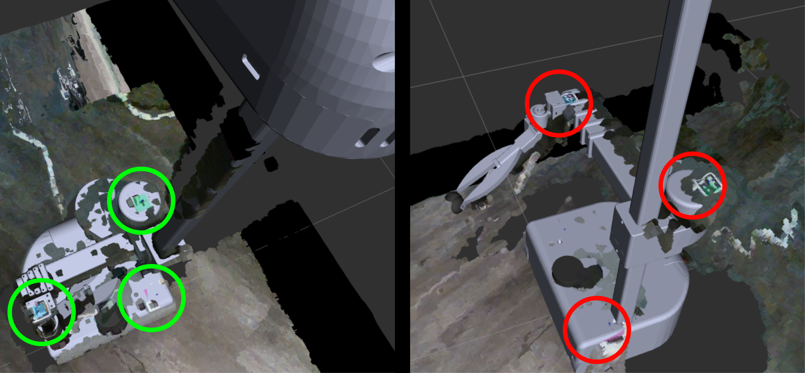

## Overview

*stretch_calibration* provides tools for calibrating and managing the URDF for the Stretch RE1 robot from Hello Robot Inc. The code's primary role is to generate a geometric model (i.e., a URDF) of the robot's body that corresponds well with views of the body from the robot's 3D camera (i.e., a Intel RealSense D435i). The code achieves this objective by adjusting the geometry of the model to predict where the 3D camera will see markers (i.e., ArUco markers) on the robot's body. 

Hello Robot Inc. uses this code to calibrate each robot prior to shipping. Users may wish to recalibrate their robots to compensate for changes over time or take advantage of improvements to the calibration code. 

In addition, after changing a tool, this code can be used to generate a new calibrated URDF that incorporates the tool without performing a new calibration optimization. 

## Visually Inspecting the Current Calibration

The following command will allow you to visually inspect a calibration with Rviz. You can use RViz to see how well the robot's 3D body model matches point clouds from the 3D camera. While visualizing the 3D model and point clouds in RViz, you can use keyboard commands in the terminal to move the head around, the lift up and down, and the arm in and out. The keyboard commands will be printed in the terminal.

A good calibration should result in a close correspondence between the robot's 3D body model and the point cloud throughout the ranges of motion for the head, lift, and arm. You may notice higher error when the head is looking upward due to challenges associated with head tilt backlash. You might also notice higher error when the arm is fully extended, since small angular errors can result in larger positional errors at the robot's wrist.

1. Test the current head calibration

   `roslaunch stretch_calibration simple_test_head_calibration.launch`

### Examples of Good and Bad Visual Fit

In the images below, examples of good and bad fit between the point cloud and the geometric model are presented side by side. To make the distinction clear, the images have green and red circles indicating where the fit is either good or bad.

## Calibrate the Stretch RE1

1. Make sure the basic joint limit calibration has been performed.

   `stretch_robot_home.py`
   
1. Make sure the uncalibrated URDF is up to date.

   `rosrun stretch_calibration update_uncalibrated_urdf.sh`
   
1. Collect head calibration data
   - Put the robot on a flat surface. Give it room to move its arm and good lighting. Then, have the robot collect data using the command below. While the robot is collecting data, do not block its view of its markers. 

      `roslaunch stretch_calibration collect_head_calibration_data.launch`
      
1. Process head calibration data

   - Specify how much data to use and the quality of the fit
   
     - YAML file with parameters: stretch_ros/stretch_calibration/config/head_calibration_options.yaml
     
     - More data and higher quality fitting result in optimizations that take longer
     
     - When quickly testing things out
       - ~3 minutes without visualization
       - `data_to_use: use_very_little_data`
       - `fit_quality: fastest_lowest_quality`
       
     - When calibrating the robot 
       - ~1 hour without visualization
       - `data_to_use: use_all_data`
       - `fit_quality: slow_high_quality`
       
   - Perform the optimization to fit the model to the collected data
   
     - Without visualization (faster)  
     
       `roslaunch stretch_calibration process_head_calibration_data.launch`
     
     - With visualization (slower)
      
       `roslaunch stretch_calibration process_head_calibration_data_with_visualization.launch`
      
1. Inspect the fit of the most recent head calibration

   `rosrun stretch_calibration visualize_most_recent_head_calibration.sh`
   
1. Start using the newest head calibration

   `rosrun stretch_calibration update_with_most_recent_calibration.sh`
   
1. Test the current head calibration

   `roslaunch stretch_calibration simple_test_head_calibration.launch`
   
   Use RViz to visually inspect the calibrated model. The robot's 3D body model should look similar to the structure of your robot. You may refer to the section above to see examples of good and bad fit.

## Generate a New URDF After Changing the Tool

If you change the Stretch RE1's tool attached to the wrist and want to generate a new URDF for it, you can do so with xacro files in the /stretch_ros/stretch_description/urdf/ directory. Specifically, you can edit stretch_description.xacro to include a xacro other than the default stretch_gripper.xacro. 

After changing the tool xacro you will need to generate a new URDF and also update this new URDF with the previously optimized calibration parameters. To do so, follow the directions below: 

1. In a terminal start roscore. This will enable the main script to proceed and terminate without pressing Ctrl-C.

   `roscore`

1. Next, in a different terminal terminal run

   `rosrun stretch_calibration update_urdf_after_xacro_change.sh`
   
This will update the uncalibrated URDF with the current xacro files and then create a calibrated URDF using the most recent calibration parameters.

## Revert to a Previous Calibration

When a new calibration is performed, it is timestamped and added to the calibration directory under "stretch_user/". If you'd like to revert to a previous calibration, you may run the following command. It will move the most recent calibration files to a reversion directory and update the calibration in the stretch_description package from the remaining most recent calibration files.

1. Revert to the previous head calibration

   `rosrun stretch_calibration revert_to_previous_calibration.sh`

## License

stretch_calibration is licensed with the GPLv3. Please see the LICENSE file for details.
